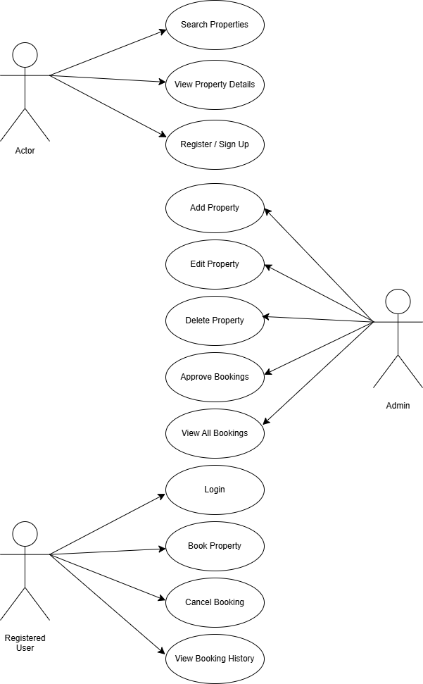

# Requirement Analysis in Software Development

## Introduction

This repository explores the concept of Requirement Analysis in software development. It provides insights into its definition, importance, key activities, and types of requirements. It also includes examples like use case diagrams and acceptance criteria, based on a booking management system, to support practical understanding.

---

## What is Requirement Analysis?

Requirement Analysis is the process of identifying, analyzing, and documenting the needs and expectations of stakeholders for a new or modified software system. It serves as a foundational phase in the Software Development Life Cycle (SDLC) that ensures all stakeholders have a shared understanding of the system to be built.

It includes techniques such as interviews, surveys, use case modeling, and prototyping. The outcomes guide design, development, and testing activities to ensure the final product aligns with user needs and business objectives.

---

## Why is Requirement Analysis Important?

- **Defines Project Scope Clearly**  
  Helps determine what the system will and will not do, minimizing ambiguity and scope creep.

- **Improves Communication**  
  Ensures all stakeholders—from clients to developers—share a unified understanding of the system requirements.

- **Reduces Development Costs**  
  Detecting and addressing issues early in the development lifecycle is significantly less costly than fixing them post-implementation.

---

## Key Activities in Requirement Analysis

- **Requirement Gathering**  
  Collecting initial input from stakeholders using interviews, surveys, questionnaires, etc.

- **Requirement Elicitation**  
  Refining and expanding raw data through techniques like brainstorming, prototyping, and observation.

- **Requirement Documentation**  
  Producing structured documents such as the Software Requirements Specification (SRS), user stories, and use cases.

- **Requirement Analysis and Modeling**  
  Understanding relationships and dependencies among requirements using models and diagrams.

- **Requirement Validation**  
  Reviewing and confirming requirements with stakeholders to ensure accuracy, feasibility, and alignment with business goals.

---

## Types of Requirements

### Functional Requirements

These specify what the system should do—its features and functionality.

**Examples (Booking System):**
- Users can search for available properties based on location and date.
- Admins can create, update, or delete property listings.
- Users can make and manage bookings.
- Users can register and log in securely.

### Non-functional Requirements

These define how the system performs its functions, focusing on performance, usability, reliability, and security.

**Examples (Booking System):**
- The system should respond to search queries in under 2 seconds.
- The system should support at least 1,000 concurrent users.
- User data must be encrypted using industry-standard security protocols (e.g., HTTPS, SSL/TLS).
- The application must have 99.9% uptime availability.

---

## Use Case Diagrams

Use Case Diagrams visualize the interactions between users (actors) and the system. They are essential in identifying user goals and the system’s intended functions.

**Actors:**
- Guest User
- Registered User
- Admin

**Use Cases:**
- Search Properties
- View Property Details
- Register/Login
- Book a Property
- Cancel Booking
- Add/Edit/Delete Listing (Admin)

---

## Acceptance Criteria

Acceptance Criteria are a set of predefined conditions that must be met for a feature to be accepted by stakeholders. They ensure clarity between developers and stakeholders and help verify functionality.

**Example: Checkout Feature Acceptance Criteria**
- The user must be logged in to access the checkout page.
- The checkout process must display a summary of booking details.
- The payment gateway must confirm a successful transaction before finalizing the booking.
- A confirmation email must be sent to the user upon successful booking.

---

## License

This repository is part of a learning project for understanding Requirement Analysis and is intended for educational purposes.
